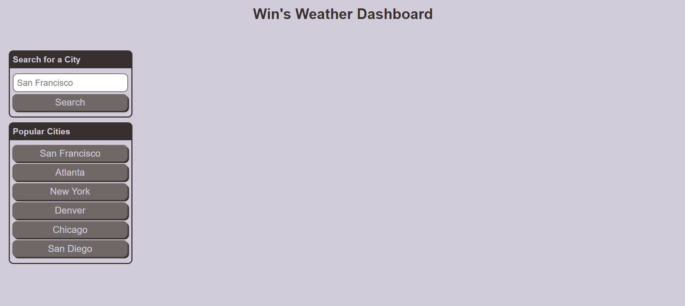
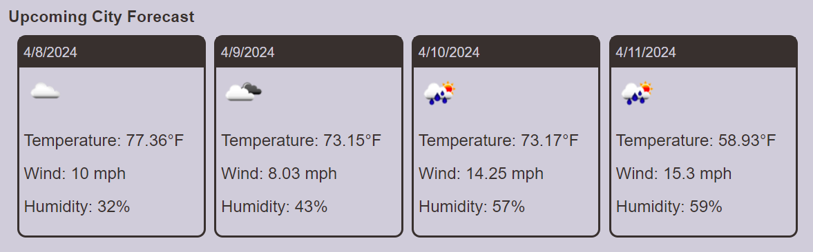

# Weather App

## Description

This Weather App provides users with current weather information and a 5-day forecast for any city worldwide. Users can search for a city and view the current weather conditions, including temperature, wind speed, and humidity, as well as the forecast for the next five days.

Live Site URL: https://winpom.github.io/weather-dashboard/

## Features

- **Search for City**: Users can search for any city to view its current weather conditions and 5-day forecast.

- **Today's Weather**: The app displays today's weather information, including temperature, wind speed, and humidity, at the top of the page.

- **5-Day Forecast**: Users can view the weather forecast for the next five days, with each day's forecast displayed in a separate card.

- **Dynamic Weather Icons**: Weather icons or emojis representing different weather conditions are displayed alongside the forecast, making it easy for users to understand the weather at a glance.

- **Search History**: Each city search, whether by button or user input, will be logged in Local Storage and visible onsite!

## Technologies Used

- HTML5
- CSS3
- JavaScript
- Fetch API

## Installation

1. Clone this repository to your local machine.
2. Open the `index.html` file in your web browser.

## Usage

- Enter the name of a city in the search bar and click "Search" to view its weather forecast.
- The current weather conditions and today's forecast will be displayed at the top of the page.
- Scroll down to view the 5-day forecast, with each day's weather displayed in a separate card.

## Contributing

Contributions are welcome! If you'd like to contribute to this project, please fork the repository, make your changes, and submit a pull request with your proposed updates.

## License

This project is licensed under the [MIT License](LICENSE).

## Acknowledgments

- Special thanks to [OpenWeather](https://openweathermap.org/) for providing the weather API used in this project.
